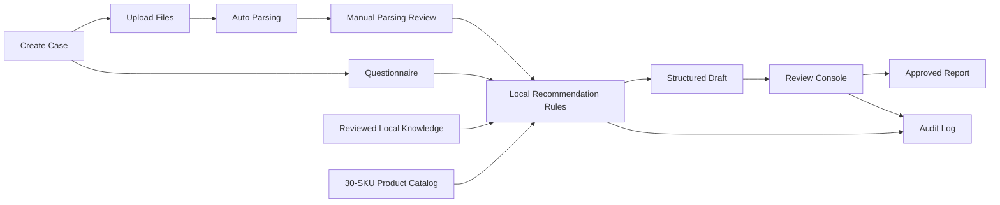

# Architecture Overview

## 一期定位

当前版本定位为本地可跑通的内部专家工作台：
- 客户上传体检报告和补充问卷
- 系统先做自动抽取
- 顾问进行人工解析校对
- 系统仅基于本地产品目录和本地已审核知识生成结构化草案
- 顾问审核后发布最终内容

## 关键原则

- 不调用 `ima`
- 不把本地资料直接训练到底模里
- 不依赖外部知识库做运行时检索
- 推荐边界由 `本地产品目录 + 本地已审核知识 + 规则层` 决定
- 报告整理层可以以后接云端 LLM，但不负责决定推荐什么 SKU

## 运行流

## 模块说明

### Case Intake
- 创建病例
- 记录顾问信息和同意信息
- 接收上传文件
- 驱动病例状态流转

### Document Parsing
- 按文件类型做文本优先抽取
- `DOCX / TXT` 先走原生文本提取
- `PDF / PNG / JPG` 允许只得到部分文本，后续由顾问人工修正
- 保留 `source_span` 方便审核追溯

### Manual Parsing Review
- 顾问可以编辑校对文本
- 顾问可以编辑标准化指标 JSON
- 顾问可以补充缺失字段和审核备注
- 只有完成人工校对的病例才能进入推荐

### Recommendation Engine
- 规则层先处理红旗、禁忌、必须人工升级的情形
- SKU 只允许来自本地 `30` 款产品目录
- 本地已审核知识只作为证据补充和生活方式建议来源
- 没有证据时拒答，不用模型常识补全

### Review Console
- 展示病例摘要、文件、校对文本和标准化指标
- 展示结构化草案、候选 SKU、风险提示和证据来源
- 支持编辑最终发布文案

### Persistence
- 运行数据全部落到 `SQLite + 本地文件夹`
- 持久化内容包括：病例、上传文件元数据、草案、审核记录、审计日志、产品目录、知识条目和知识资料清单

## 当前技术栈

- Backend: `FastAPI + Pydantic + sqlite3`
- Frontend: `Next.js + React + TypeScript`
- Local storage: `SQLite + filesystem`
- Knowledge retrieval: `local keyword vector store (in-memory)`
- OCR / parsing: `document OCR provider with text-first extraction`

## 容器化约束

虽然 Docker 放在最后做，但代码已经按未来容器化约束写：
- 路径全部来自环境变量
- 不写死 `D:\medical`
- SQLite、上传目录和知识资料根目录都可配置
- 仓库根目录已经补齐 Docker 交付文件
