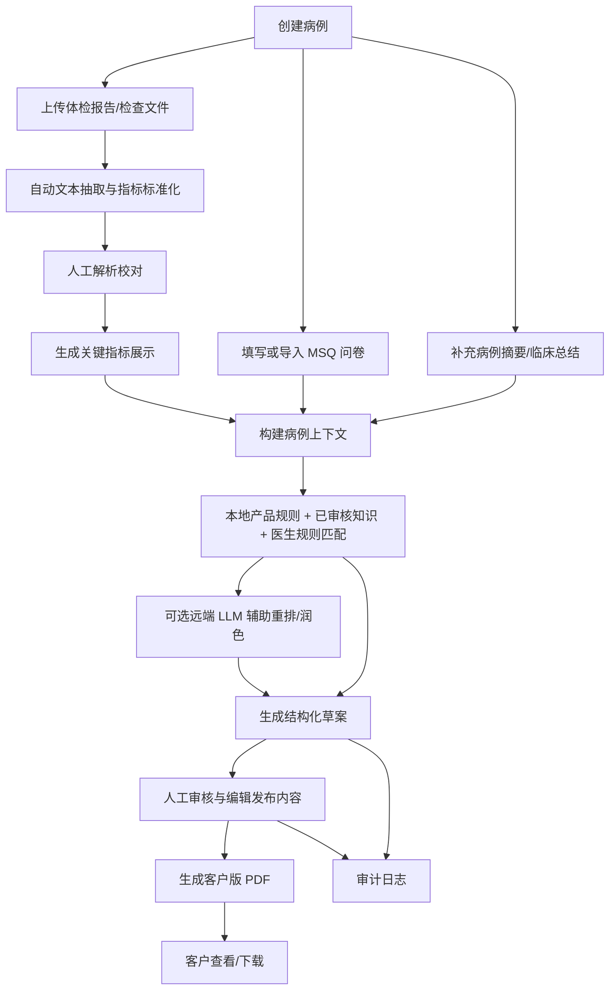
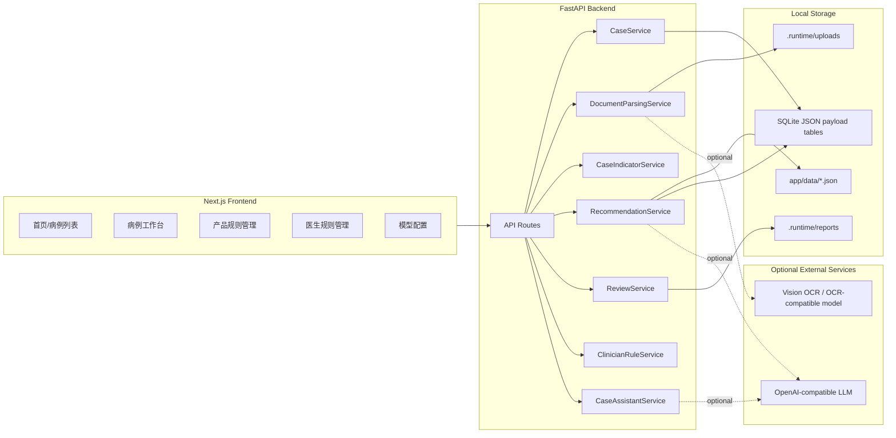

# 功能医学营养推荐工作台功能设计与业务流程文档

版本：v1.0  
日期：2026-04-27  
适用范围：当前代码库 `D:\medical` 的本地版功能医学营养推荐工作台

## 1. 文档目的

本文档用于把当前项目交付给外部合作方、部署方或二次开发团队时，说明系统的业务定位、功能边界、核心流程、模块设计、数据对象、接口范围、部署验收和当前限制。

本系统不是面向客户自助使用的诊疗产品，而是面向内部顾问/医生/营养师的病例工作台。系统负责把体检报告、问卷、人工校对信息、本地产品目录、已审核知识和医生经验规则整合成结构化草案，并在人工审核后导出客户版 PDF。

## 2. 系统定位

系统名称：Functional Medicine Nutrition AI Local Workbench  
核心定位：本地可部署、可人工审核、可追溯的功能医学营养干预建议工作台。

核心原则：

- 只推荐本地产品目录内的 SKU。
- 推荐边界由本地产品规则、本地已审核知识、红旗/禁忌规则、人工校对数据共同决定。
- 云端大模型为可选增强层，主要用于排序、摘要和语言组织，不允许绕过本地产品目录和安全规则。
- 上传报告自动解析后必须支持人工校对，不能假设 OCR 一次准确。
- 最终对外报告必须经过人工审核发布。
- 客户版 PDF 尽量口语化，减少内部审计、证据编号和专业冗余内容。

## 3. 使用角色

当前代码未内置登录、鉴权和细粒度权限控制。业务上可先按以下角色理解：

| 角色 | 主要职责 | 当前系统承载方式 |
| --- | --- | --- |
| 顾问/医生/营养师 | 创建病例、上传资料、校对解析、填写或导入问卷、生成草案、审核发布 | 前端病例工作台 |
| 产品/运营维护人员 | 维护本地产品目录、适应证、禁忌、剂量、警示信息 | 产品规则页面 |
| 临床规则维护人员 | 把医生经验沉淀成后续可复用规则 | 小助手与医生规则页面 |
| 部署/运维人员 | 配置环境变量、运行后端和前端、备份 SQLite 与上传文件 | `.env`、Docker、本地脚本 |
| 外部对接方 | 通过 API 或页面接入病例流程、获取 PDF 或结构化数据 | FastAPI REST 接口 |

如交付给外部正式使用，建议在网关层或应用层补充账号、权限、审计主体和访问控制。

## 4. 总体业务流程



### 4.1 标准操作步骤

1. 在首页创建病例，填写客户姓名、顾问信息，并选择分析模式。
2. 进入病例工作台，上传 `PDF / DOCX / PPTX / TXT / PNG / JPG` 等资料。
3. 系统自动抽取文本、识别检验项、标准化单位与参考范围。
4. 顾问在“人工解析校对”区域修正文本、标准化指标 JSON、缺失项和备注。
5. 顾问手动填写问卷，或上传已填写的 MSQ `DOCX` 问卷自动导入。
6. 可补充病例摘要/临床总结，作为推荐和报告整理的辅助上下文。
7. 点击生成结构化草案。
8. 系统生成草案后展示关键指标、营养素方案、生活方式建议、检测建议、随访计划、风险提示、候选产品和证据。
9. 顾问审核“发布内容”，必要时编辑客户可读文本。
10. 点击审核并发布，系统生成 PDF 并记录审核决策。
11. 后续可重新下载 PDF，或继续沉淀医生经验规则。

## 5. 功能模块设计

### 5.1 病例管理

入口：

- 前端：首页病例列表与创建表单。
- 后端：`CaseService`、`/cases` 系列接口。

能力：

- 创建病例。
- 查看病例列表。
- 查看病例详情。
- 删除病例及其上传文件、草案、审核记录、PDF。
- 维护病例状态流转。

病例状态：

| 状态 | 含义 |
| --- | --- |
| `intake` | 已创建，尚未上传资料 |
| `files_received` | 已上传文件 |
| `parsing_completed` | 自动解析完成 |
| `ready_for_recommendation` | 人工校对完成，可生成草案 |
| `draft_generated` | 已生成推荐草案 |
| `under_review` | 草案等待审核 |
| `approved` | 已审核发布 |

### 5.2 文件上传与文档解析

入口：

- 前端：病例工作台文件上传区。
- 后端：`DocumentParsingService`、`DocumentOCRProvider`、`LabNormalizationService`。

支持文件类型：

- `PDF`
- `DOC / DOCX`
- `PPTX`
- `TXT`
- `PNG / JPG / JPEG`

解析策略：

- 文本优先：DOCX、PPTX、TXT、带文本层 PDF 优先走本地文本提取。
- 图片/OCR：图片和扫描 PDF 可使用配置的远端 OCR 能力；未配置时可返回空或部分文本，再由人工校对。
- 保留来源片段：每个抽取行会保存 `SourceSpan`，用于后续追溯。

输出：

- 原始抽取文本。
- 文本行 source spans。
- 标准化检验项 `ExtractedLabItem`。
- 文件解析置信度。
- 是否需要人工复核。

### 5.3 人工解析校对

入口：

- 前端：病例工作台“解析校对”区域。
- 后端：`PUT /cases/{case_id}/parsing-review`。

能力：

- 编辑每个文件的校对文本。
- 编辑标准化检验项 JSON。
- 记录缺失字段。
- 记录校对备注。
- 校对完成后病例进入可推荐状态。

业务意义：

- 把 OCR 不稳定性从推荐链路中剥离出来。
- 草案生成只依赖已校对数据，降低误推荐风险。

### 5.4 关键指标识别与展示

入口：

- 后端：`CaseIndicatorService`。
- 前端：病例工作台“关键指标”表格。

来源：

- 标准化检验项 `ExtractedLabItem`。
- 病历文本中的主诉、体征、检查小结、通用检验行、纵向表格指标。

状态分类：

| 状态 | 含义 |
| --- | --- |
| `normal` | 正常 |
| `attention` | 需关注，常用于高/低/异常 |
| `positive` | 阳性发现 |
| `info` | 信息类，未必可判断异常 |

去重逻辑：

- 按类别、规范化指标名、结果文本去重。
- 会规避表格中同一指标因中文名与英文缩写拼接导致的重复识别。

PDF 输出规则：

- 工作台仍可展示完整指标。
- 客户版 PDF 只展示 `attention` 和 `positive` 指标。
- 客户版 PDF 中异常指标标红，并追加口语化说明。

### 5.5 问卷录入与 MSQ 导入

入口：

- 前端：病例工作台 MSQ/问卷区域。
- 后端：`QuestionnaireImportService`、`/cases/{case_id}/questionnaire`、`/cases/{case_id}/questionnaire-file`。

问卷字段：

- 年龄、性别。
- 主要诉求、症状、已知病史、家族史。
- 用药、过敏、食物敏感。
- 饮食结构、工作生活方式、久坐时间、外食频率。
- 睡眠、运动、排便、压力、情绪。
- 健康目标。
- MSQ 系统评分。

导入能力：

- 支持已填写 MSQ `DOCX`。
- 解析表格和勾选项。
- 导入后写入病例问卷字段。

### 5.6 临床摘要/病例总结

入口：

- 前端：病例工作台临床摘要区域。
- 后端：`/cases/{case_id}/clinical-summary`、`/cases/{case_id}/clinical-summary-image`。

能力：

- 手动录入临床摘要。
- 上传图片形式摘要并 OCR 导入。
- 自动清理重复行和噪声。

用途：

- 提供额外临床上下文。
- 提取“所需营养素提示”。
- 影响候选产品排序和报告章节内容。

### 5.7 推荐草案生成

入口：

- 前端：病例工作台“生成草案”。
- 后端：`RecommendationService.generate`、`POST /cases/{case_id}/drafts:generate`。

输入：

- 病例基础信息。
- 人工校对后的报告文本和标准化指标。
- 问卷信息。
- 临床摘要。
- 本地产品目录。
- 已审核知识。
- 医生经验规则。
- 可选 LLM 配置。

核心步骤：

1. 构建病例上下文 `RecommendationContext`。
2. 识别红旗风险和缺失信息。
3. 从关键指标和问卷生成支持画像 `SupportProfile`。
4. 检索本地已审核知识。
5. 根据产品适应证、禁忌、生活方式标签、病例信号和医生规则给产品打分。
6. 只从本地启用产品中选出候选。
7. 可选远端 LLM 在候选范围内重排、补充结构化章节和生活方式文本。
8. 过滤目录外 SKU、禁忌冲突和不合规返回。
9. 生成结构化草案 `RecommendationDraft`。

输出草案内容：

- 病例摘要。
- 总体健康画像。
- 关键指标摘要。
- 原报告小结与建议。
- 系统功能深度分析。
- 风险提示。
- 个性化营养素方案。
- 生活方式干预重点。
- 功能医学检测建议。
- 随访计划。
- 90 天健康路线图。
- 待确认项。
- 审核备注。
- 推荐 SKU 列表、原因、证据、警示。

### 5.8 产品目录管理

入口：

- 前端：`/products` 产品规则页面。
- 后端：`/catalog/products` 系列接口。
- 数据：`backend/app/data/product_catalog.json` + SQLite 产品表。

产品规则字段：

- `sku_id`
- `display_name`
- `category`
- `formula_summary`
- `core_ingredients`
- `candidate_use_cases`
- `contraindications`
- `enabled`
- `indications`
- `exclusions`
- `dosage_rule`
- `interaction_rule`
- `warning_text`
- `lifestyle_tags`
- `priority`

业务规则：

- 新增、编辑、删除产品会影响后续新生成草案。
- 生成草案时只允许选择本地目录中的产品。
- 禁用产品不参与默认推荐。

### 5.9 医生经验规则与小助手

入口：

- 前端：病例工作台小助手、`/assistant` 医生规则页面。
- 后端：`ClinicianRuleService`、`CaseAssistantService`。

医生规则能力：

- 从具体病例创建规则。
- 从医生指令中识别目标产品/SKU。
- 将当前病例的指标、支持画像、目标、症状、主诉、病史沉淀为触发条件。
- 后续相似病例生成草案时，作为可审计加权依据。
- 支持启用/停用、编辑、删除规则。

小助手能力：

- 总结当前病例。
- 解释当前草案为什么这样推荐。
- 查看当前命中的医生规则。
- 回答下一步操作建议。
- 接收医生经验语句并沉淀为规则。

重要边界：

- 医生新增规则时应提到现有产品全名或 SKU。
- 小助手沉淀规则不是直接修改当前草案，而是影响后续相似病例或重新生成草案。

### 5.10 审核发布与客户版 PDF

入口：

- 前端：病例工作台“审核后发布内容”和“审核并发布”按钮。
- 后端：`ReviewService`、`PdfReportExporter`。

审核发布逻辑：

- 顾问可以编辑最终发布 Markdown。
- 如果发布内容为空，后端生成默认客户版报告。
- 如果检测到旧版内部报告内容，后端会自动转成新版客户版报告。
- 审核后生成 `ReviewDecision`，保存 PDF 路径，并写入审计日志。

客户版 PDF 当前设计：

- 删除病例摘要、证据来源、审核备注、审计信息等内部内容。
- 总体健康画像偏口语化。
- 关键指标只展示异常/需关注项，并标红。
- 每个异常指标后追加说明。
- 生活方式干预重点更完整，参考 24 套功能医学生活方式协议的思想，覆盖饮食、睡眠、压力、活动、肠道、肝胆、甲状腺、代谢和安全边界。
- 列表符号使用 ASCII 短横线，避免 PDF 字体显示异常。

### 5.11 LLM 配置

入口：

- 前端：`/llm-config`。
- 后端：`/system/llm-config`。

配置项：

- `base_url`
- `api_key`
- `model`
- `api_style`
- `timeout_seconds`
- `temperature`

可选模式：

- 未配置 LLM：使用本地 deterministic composer。
- 已配置 LLM：远端模型辅助排序和章节组织，后端仍做本地规则兜底。

LLM 边界：

- 只能从本地候选 SKU 中选择。
- 返回目录外 SKU 会被丢弃。
- 红旗风险、禁忌、人工校对未完成等硬性边界由本地规则控制。
- 远端失败或返回不合规时自动回退本地 composer。

### 5.12 知识资料与审计

知识来源：

- `backend/app/data/knowledge_statements.json`
- `backend/app/data/knowledge_import_ai_learning_report.json`
- 本地资料目录由 `FM_KNOWLEDGE_ROOT` 指定。

知识使用原则：

- 只有已审核知识参与自动推荐。
- 未审核资料可作为资料清单或人工参考，不应直接驱动推荐。

审计日志：

- 关键操作写入 `AuditLog`。
- 包括病例创建、上传解析、人工校对、草案生成、审核发布、产品目录变更、医生规则变更等。

## 6. 系统架构



### 6.1 后端技术栈

- FastAPI
- Pydantic v2
- SQLite
- ReportLab
- pypdf
- httpx

### 6.2 前端技术栈

- Next.js 15
- React 19
- TypeScript

### 6.3 数据持久化

当前仓储类名为 `LocalRepository`，底层为 SQLite。主要表以 JSON payload 方式保存领域对象。

主要持久化内容：

- 病例 `cases`
- 草案 `drafts`
- 审核决策 `reviews`
- 审计日志 `audit_logs`
- 知识条目 `knowledge`
- 产品目录 `products`
- 知识资料清单 `knowledge_manifest`
- 医生经验规则 `clinician_rules`

文件持久化：

- 上传文件保存到 `FM_UPLOAD_DIR`。
- PDF 报告保存到 `FM_REPORT_EXPORT_DIR` 或配置中的 report export dir。

## 7. 核心数据对象

### 7.1 CaseRecord

病例主对象，包含客户姓名、顾问、分析模式、状态、上传文件、问卷、标准化指标、草案 ID、解析校对信息等。

关键字段：

- `id`
- `customer_name`
- `consultant_id`
- `analysis_mode`
- `status`
- `clinical_summary_text`
- `files`
- `questionnaire`
- `extracted_lab_items`
- `draft_ids`
- `parsing_review_completed`
- `parsing_missing_fields`

### 7.2 UploadedFile

上传文件元数据和解析结果。

关键字段：

- `id`
- `case_id`
- `filename`
- `content_type`
- `storage_uri`
- `raw_extracted_text`
- `corrected_text`
- `source_spans`
- `parse_confidence`
- `parse_status`
- `needs_manual_review`

### 7.3 ExtractedLabItem

结构化检验项。

关键字段：

- `marker_code`
- `marker_name`
- `raw_name`
- `raw_value`
- `value`
- `unit`
- `normalized_value`
- `normalized_unit`
- `ref_range`
- `abnormal_flag`
- `confidence`
- `source_span`

### 7.4 CaseIndicator

给工作台和 PDF 使用的关键指标展示对象。

关键字段：

- `indicator_name`
- `result_text`
- `status`
- `category`
- `source_span`

### 7.5 Questionnaire

问卷对象，覆盖基础信息、症状、病史、生活方式、饮食、睡眠、运动、情绪、目标和 MSQ 评分。

### 7.6 ProductRule

产品目录规则对象，是推荐 SKU 的唯一来源。

关键字段：

- `sku_id`
- `display_name`
- `formula_summary`
- `core_ingredients`
- `candidate_use_cases`
- `indications`
- `exclusions`
- `contraindications`
- `dosage_rule`
- `interaction_rule`
- `warning_text`
- `lifestyle_tags`
- `priority`

### 7.7 ClinicianRule

医生经验规则对象。

关键字段：

- `id`
- `title`
- `instruction_text`
- `source_case_id`
- `enabled`
- `action`
- `strength`
- `target_sku_ids`
- `trigger_marker_rules`
- `trigger_support_profiles`
- `trigger_goals`
- `trigger_symptoms`
- `trigger_chief_concerns`
- `trigger_conditions`

### 7.8 RecommendationDraft

结构化推荐草案。

关键字段：

- `id`
- `case_id`
- `status`
- `case_summary`
- `key_lab_highlights`
- `recommended_skus`
- `lifestyle_actions`
- `rationale`
- `evidence_ids`
- `evidence_details`
- `contraindications`
- `missing_info`
- `confidence`
- `abstain_reason`
- `red_flags`
- `report_sections`

### 7.9 ReviewDecision

审核发布对象。

关键字段：

- `draft_id`
- `reviewer_id`
- `final_status`
- `publishable_report`
- `pdf_report_path`
- `pdf_report_filename`
- `audit_log_id`
- `approved_at`

## 8. API 设计概览

后端默认地址：`http://127.0.0.1:8000`

### 8.1 健康检查

| 方法 | 路径 | 说明 |
| --- | --- | --- |
| GET | `/health` | 返回 `{"status":"ok"}` |

### 8.2 病例

| 方法 | 路径 | 说明 |
| --- | --- | --- |
| GET | `/cases` | 获取病例列表 |
| POST | `/cases` | 创建病例 |
| GET | `/cases/{case_id}` | 获取病例详情 |
| DELETE | `/cases/{case_id}` | 删除病例及关联数据 |

创建病例请求示例：

```json
{
  "customer_name": "张三",
  "consultant_id": "nutrition-team",
  "notes": "初次评估",
  "analysis_mode": "llm_primary"
}
```

### 8.3 文件与解析

| 方法 | 路径 | 说明 |
| --- | --- | --- |
| POST | `/cases/{case_id}/files` | 上传报告文件并自动解析 |
| POST | `/cases/{case_id}/files/{file_id}:reparse` | 重新解析指定文件 |
| PUT | `/cases/{case_id}/parsing-review` | 保存人工解析校对结果 |

人工校对请求核心结构：

```json
{
  "reviewer_id": "reviewer-01",
  "files": [
    {
      "file_id": "file_xxx",
      "corrected_text": "人工校对后的文本",
      "missing_fields": []
    }
  ],
  "normalized_lab_items": [],
  "missing_fields": [],
  "review_notes": "已核对"
}
```

### 8.4 问卷与病例摘要

| 方法 | 路径 | 说明 |
| --- | --- | --- |
| POST | `/cases/{case_id}/questionnaire` | 提交结构化问卷 |
| POST | `/cases/{case_id}/questionnaire-file` | 上传 MSQ DOCX 并导入问卷 |
| PUT | `/cases/{case_id}/clinical-summary` | 保存临床摘要文本 |
| POST | `/cases/{case_id}/clinical-summary-image` | 上传临床摘要图片并 OCR 导入 |

### 8.5 草案与报告

| 方法 | 路径 | 说明 |
| --- | --- | --- |
| POST | `/cases/{case_id}/drafts:generate` | 生成推荐草案 |
| GET | `/drafts/{draft_id}` | 获取草案和审核决策 |
| POST | `/drafts/{draft_id}/approve` | 审核发布 |
| GET | `/drafts/{draft_id}/report.pdf` | 下载 PDF |

生成草案请求：

```json
{
  "requested_by": "reviewer-01"
}
```

审核发布请求：

```json
{
  "reviewer_id": "reviewer-01",
  "publishable_summary": "# 功能医学营养与生活方式建议\n...",
  "edits": {}
}
```

### 8.6 产品目录

| 方法 | 路径 | 说明 |
| --- | --- | --- |
| GET | `/catalog/products` | 获取产品目录 |
| GET | `/catalog/products/{sku_id}` | 获取单个产品 |
| POST | `/catalog/products` | 新增产品规则 |
| PUT | `/catalog/products/{sku_id}` | 更新产品规则 |
| DELETE | `/catalog/products/{sku_id}` | 删除产品规则 |

### 8.7 医生规则与小助手

| 方法 | 路径 | 说明 |
| --- | --- | --- |
| GET | `/assistant/rules` | 获取医生规则列表 |
| POST | `/assistant/rules/from-case` | 从当前病例创建医生经验规则 |
| PUT | `/assistant/rules/{rule_id}` | 更新医生规则 |
| DELETE | `/assistant/rules/{rule_id}` | 删除医生规则 |
| POST | `/assistant/cases/{case_id}/chat` | 小助手对话 |

创建医生规则请求：

```json
{
  "case_id": "case_xxx",
  "author_id": "reviewer-01",
  "instruction_text": "以后遇到类似病例，优先推荐富硒维生素E。"
}
```

### 8.8 模型配置与知识清单

| 方法 | 路径 | 说明 |
| --- | --- | --- |
| GET | `/system/llm-config` | 查看 LLM 配置状态 |
| PUT | `/system/llm-config` | 更新 LLM 配置 |
| GET | `/knowledge/manifest` | 查看知识资料清单 |

## 9. 前端页面设计

| 页面 | 路径 | 说明 |
| --- | --- | --- |
| 首页/仪表盘 | `/` | 创建病例、选择分析模式、查看病例列表、删除病例、跳转功能模块 |
| 病例工作台 | `/cases/[id]` | 上传资料、问卷、校对、生成草案、审核发布、小助手、医生规则 |
| 产品规则 | `/products` | 新增、编辑、删除产品规则 |
| 医生规则 | `/assistant` | 查看和编辑医生经验规则 |
| 模型配置 | `/llm-config` | 配置远端 LLM/OCR 相关参数 |

## 10. 推荐决策边界

### 10.1 可以自动完成的部分

- 从已校对病例数据中提取异常指标。
- 根据本地指标字典和规则匹配产品适应证。
- 根据问卷症状和目标生成支持画像。
- 根据已审核知识补充证据和生活方式建议。
- 根据医生经验规则对特定产品加权。
- 生成结构化草案和客户版报告初稿。

### 10.2 必须人工确认的部分

- OCR/解析结果是否准确。
- 用药、过敏、孕哺、儿童、高风险病史等安全信息。
- 是否发布推荐。
- 最终客户报告措辞。
- 目录外产品、非本地知识、未审核资料不能自动进入推荐。

### 10.3 拒答/拦截场景

系统会在以下情况倾向拒答、保守处理或要求人工复核：

- 存在红旗风险。
- 人工解析校对未完成。
- 关键安全信息缺失。
- 用药/过敏/禁忌与产品冲突。
- 远端模型返回目录外 SKU 或不合规 JSON。
- 推荐证据不足。

## 11. 客户版 PDF 设计

客户版 PDF 面向最终客户阅读，和内部结构化草案不同。

默认章节：

1. 总体健康画像。
2. 关键指标。
3. 风险提示。
4. 个性化营养素方案。
5. 生活方式干预重点。
6. 复查与跟进建议。
7. 需要补充确认。
8. 重要提醒。

PDF 特殊规则：

- 不展示病例摘要。
- 不展示证据来源、审核备注、审计信息。
- 正常指标不展示。
- 异常指标标红。
- 异常指标后增加解释。
- 内容尽量客户可读、口语化。
- 列表符号使用 `-`，避免字体兼容问题。

## 12. 部署与运行

### 12.1 本地运行

后端：

```bash
cd backend
pip install -r requirements.txt
uvicorn app.main:app --host 127.0.0.1 --port 8000 --reload
```

前端：

```bash
cd frontend
npm install
npm run dev -- --hostname 127.0.0.1 --port 3000
```

### 12.2 Docker 运行

仓库包含：

- `compose.yaml`
- `backend/Dockerfile`
- `frontend/Dockerfile`
- `.env.example`

启动：

```bash
docker compose up --build
```

默认端口：

- 前端：`3000`
- 后端：`8000`

### 12.3 关键环境变量

后端：

- `FM_PROJECT_ROOT`
- `FM_DATA_DIR`
- `FM_RUNTIME_DIR`
- `FM_UPLOAD_DIR`
- `FM_SQLITE_PATH`
- `FM_KNOWLEDGE_ROOT`
- `FM_REPORT_REFERENCE_PATH`
- `LLM_BASE_URL`
- `LLM_API_KEY`
- `LLM_MODEL`
- `LLM_API_STYLE`
- `LLM_TIMEOUT_SECONDS`
- `LLM_TEMPERATURE`

前端：

- `NEXT_PUBLIC_API_BASE_URL`

## 13. 验收流程

建议交付验收按以下流程执行：

1. 启动后端，访问 `/health` 返回 `{"status":"ok"}`。
2. 启动前端，打开首页。
3. 创建一个新病例。
4. 上传验收报告或脱敏样例报告。
5. 检查文件解析结果和关键指标。
6. 完成人工解析校对。
7. 手动填写问卷或上传 MSQ DOCX。
8. 生成结构化草案。
9. 检查推荐 SKU 是否全部来自产品目录。
10. 检查风险提示、待确认项、生活方式建议。
11. 审核发布。
12. 下载 PDF，确认客户版内容无内部章节、无正常指标、异常指标标红且有说明。
13. 新增或修改产品规则，再生成新病例草案，确认规则生效。
14. 从病例创建医生经验规则，再创建相似病例，确认规则可命中。

自动化验证命令：

```bash
python -m unittest discover -s backend/tests -v
cd frontend
npm run build
```

## 14. 对接建议

### 14.1 如果对接方只使用页面

推荐交付：

- 前端地址。
- 后端地址。
- 操作手册。
- 验收病例。
- 产品目录维护说明。
- 数据备份说明。

### 14.2 如果对接方通过 API 集成

推荐最小 API 流：

1. `POST /cases` 创建病例。
2. `POST /cases/{case_id}/files` 上传报告。
3. `PUT /cases/{case_id}/parsing-review` 保存人工校对。
4. `POST /cases/{case_id}/questionnaire` 提交问卷。
5. `POST /cases/{case_id}/drafts:generate` 生成草案。
6. `GET /drafts/{draft_id}` 获取结构化草案。
7. `POST /drafts/{draft_id}/approve` 审核发布。
8. `GET /drafts/{draft_id}/report.pdf` 获取 PDF。

### 14.3 数据备份

必须备份：

- SQLite 文件：`FM_SQLITE_PATH`
- 上传文件目录：`FM_UPLOAD_DIR`
- PDF 报告目录：`report_export_dir`
- 产品目录 JSON：`backend/app/data/product_catalog.json`
- 知识文件：`backend/app/data/knowledge_statements.json`
- 指标字典：`backend/app/data/marker_dictionary.json`
- `.env` 或部署环境变量配置

## 15. 当前限制与后续建议

当前限制：

- 没有内置用户登录和权限系统。
- SQLite 适合单机或轻量部署，不适合作为高并发多租户数据库。
- OCR 质量依赖文件文本层或外部 OCR 配置。
- 远端 LLM 是可选能力，不应作为唯一推荐依据。
- 医生规则创建依赖医生提到现有产品名或 SKU。
- 客户版 PDF 是 ReportLab 生成，不做复杂设计排版。

后续建议：

- 增加登录、角色权限和租户隔离。
- 增加 API token 或网关鉴权。
- 对病例数据做脱敏导出和访问审计。
- 将产品目录与医生规则变更增加版本管理。
- 对 PDF 增加模板化配置和品牌样式配置。
- 增加批量导入病例和批量导出报告能力。
- 将 SQLite 升级为 PostgreSQL，以支持多人并发和正式生产部署。
- 将 OCR、LLM、对象存储抽象为正式可配置 Provider。

## 16. 交付清单

建议对接交付时包含：

- 源码仓库。
- `README.md`。
- `docs/architecture.md`。
- `docs/deployment.md`。
- 本文档：`docs/functional-design-and-business-flow.md`。
- `.env.example`。
- `compose.yaml`。
- `backend/Dockerfile`。
- `frontend/Dockerfile`。
- `backend/app/data/product_catalog.json`。
- `backend/app/data/knowledge_statements.json`。
- `backend/app/data/marker_dictionary.json`。
- 测试说明和验收样例。

## 17. 一句话总结

该项目当前是一套“医生/顾问在环”的功能医学营养推荐工作台：它用本地规则、本地产品目录、已审核知识和人工校对病例数据生成可追溯草案，再由人工审核导出客户可读 PDF；外部模型可以辅助表达和排序，但不能突破本地推荐边界。
